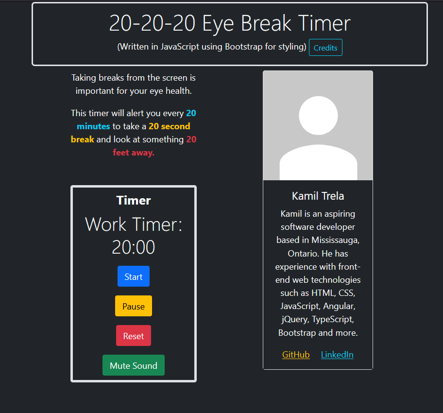

# eye-break-timer
A JavaScript application that has a timer. Every 20 minutes the user is notified to take a 20 second break to maintain eye health.

## Preview


## Description
Take frequent breaks to avoid [Computer Vision Syndrome](https://www.webmd.com/eye-health/computer-vision-syndrome), this small web app helps you do that.


## How To Use
1. Press the Start button to start a 20 minute work timer
    * Pause at any time by pressing the Pause button
2. After the work timer ends, a series of beeps should be heard. This indicates the 20 second break timer has begun
3. After the break timer ends, another set of beeps should be heard
4. Restart the 20 minute work timer by pressing the Reset button
5. Go to step 1

## Installation
Clone Repository:
```
git clone https://github.com/kamiltrela/eye-break-timer.git
```

Run Project:
```
Open the index.html file in a browser or serve it on a webserver
```

### Built with:
- HTML
- Bootstrap
- JavaScript
- howler.js

